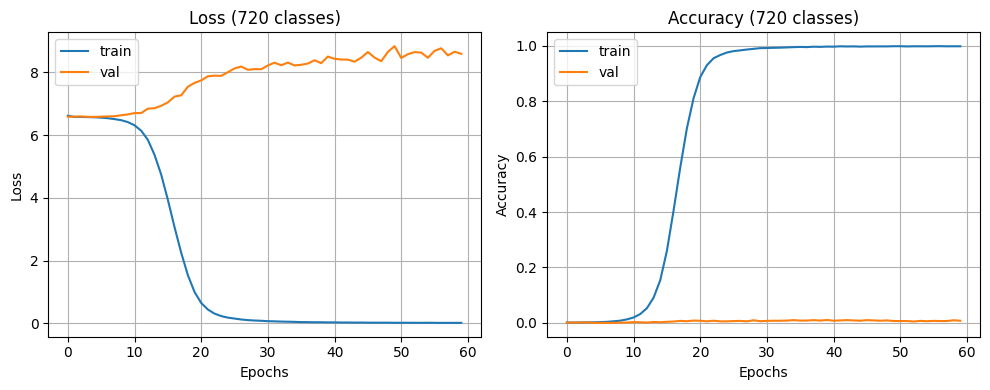
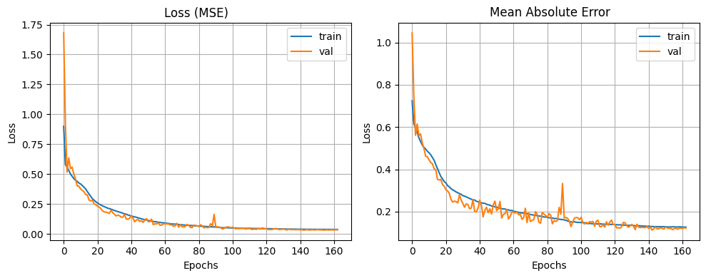
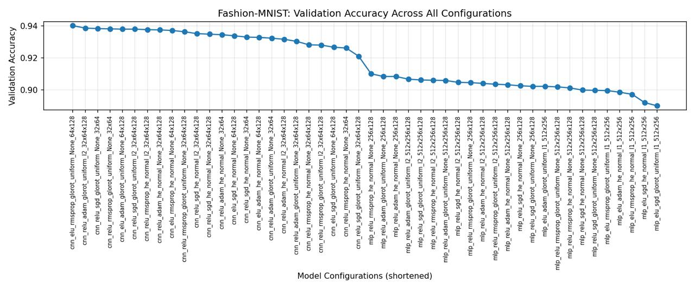

# Reading Analog Clocks with CNNs: How Output Representation Decides the Result

Five ways of framing the same task — predict the time from an image of an analog clock — trained on
the same 18,000-image dataset with the same family of convolutional backbones. Plus a
48-configuration architecture sweep on Fashion-MNIST, with the best models retrained on CIFAR-10.

**Changing only how the target is represented moves the error from 182.93 minutes to 8.52 minutes.**
The worst formulation is the one that looks most precise: treating time as 720 one-minute classes
reaches 100% training accuracy and 1.39% test accuracy, and its mean circular error is 182.93
minutes — a random guess on a 12-hour dial scores 180. Encoding the same time as a point on the unit
circle, sin(θ) and cos(θ), drops it to 24.40 minutes with no change in task or data, and a tuned
version reaches 8.52. In the Fashion-MNIST sweep, the ranking of the top three architectures
**inverts** when the same models are retrained on CIFAR-10.

**Full write-up:** [`report.pdf`](report.pdf)

## Background

Clock time is periodic: 11:59 and 12:00 are one minute apart, but any representation that treats
time as a number on a line puts them 719 minutes apart. Every result below follows from how each
model handles that wrap-around.

All models are scored with **common-sense error (CSE)**: the mean circular difference in minutes
between predicted and true time, taking the shorter way around the dial. It is the only metric
comparable across all five formulations, and it caps at 360 minutes.

## Results

### Task 2 — tell the time

| Model | Output layer | Native metric | CSE (min) |
|---|---|---|---|
| Classification, 720 classes | Softmax, 1-minute bins | 1.39% accuracy | 182.93 |
| Regression | One linear unit, fractional hours | 1.94 h MAE | 114.16 |
| Multi-head | Two linear units, hours + minutes | 5.66 h / 9.79 min MAE | 93 |
| Classification, 24 classes | Softmax, 30-minute bins | 39.17% accuracy | 82.82 |
| Classification, 12 classes | Softmax, 1-hour bins | 47.61% accuracy | 63.87 |
| sin/cos encoding | Two linear units, sin(θ) and cos(θ) | 0.2067 linear MAE | 24.40 |
| **Optimised sin/cos** | Same, deeper net plus augmentation | 0.0946 linear MAE | **8.52** |

Sorted worst to best, the table tracks neither model complexity nor output granularity. It tracks
how well the representation matches the geometry of a clock face.



The 720-class model is the clearest failure: training accuracy reaches 100% by epoch 30 while
validation accuracy stays flat near 1% and validation loss climbs from 6.5 past 8.5. With 720
unordered bins over 18,000 images each class holds roughly 25 examples, and softmax treats
predicting 11:59 for a true 12:00 as exactly as wrong as predicting 6:00.



The sin/cos models converge smoothly with validation tracking training throughout. The optimised
version adds a fifth convolutional block, L2 on the dense layer, dropout at 0.5, augmentation
(rotation, translation, zoom), a smaller batch and a longer schedule.

### Task 1 — architecture search on Fashion-MNIST and CIFAR-10

48 configurations (24 MLP, 24 CNN) varying depth, filters, kernel size, activation, optimiser,
initialiser and regularisation.



The two families separate completely: every CNN scores above roughly 0.921 validation accuracy,
every MLP below 0.910, so the worst CNN beats the best MLP. Within each family the curve declines
smoothly — optimiser, initialiser and regularisation move accuracy by about two points, while the
architecture family moves it by more than the entire spread of either family.

Top three by validation accuracy, then retrained from scratch on CIFAR-10:

| Configuration | Fashion-MNIST test | CIFAR-10 test |
|---|---|---|
| CNN, ELU, RMSprop, no reg, 64×128 | 92.7% | 67% |
| CNN, ReLU, Adam, L2, 32×64×128 | 92.0% | **73%** |
| CNN, ReLU, SGD, no reg, 32×64 | **92.9%** | 71% |

The ranking inverts. The configuration that came last of the three on Fashion-MNIST comes first on
CIFAR-10, and the CIFAR-10 winner was the weakest of the three on the dataset it was selected on.

## Discussion

**Why the representation dominates.** All five clock models share the same feature-extractor family
and see identical pixels; only the shape of the target and the loss that scores it change. A softmax
over 720 bins discards the ordering of time entirely. A single linear unit keeps the ordering but
breaks the circle — to move from 11.9 to 0.1 it must travel the whole range. sin/cos keeps both,
because a prediction near the true angle is close in Euclidean distance wherever it sits on the dial.
The feature extractor was never the bottleneck.

**Why the multi-head hour MAE looks catastrophic.** The hour head is trained with a circular MSE
loss, so it is free to answer 11.8 when the truth is 0.1 — two hours apart on the dial, 11.7 apart on
a number line. The 5.66-hour figure is a linear metric punishing exactly what the loss permits. CSE
is the number worth reading.

**Why the deeper model wins on CIFAR-10 and loses on Fashion-MNIST.** CIFAR-10 adds colour, texture
and background variation that a shallow unregularised net can overfit but not exploit. Selecting an
architecture on one dataset does not transfer, even between two 10-class benchmarks of similar size.

## Limitations

- **The classification models trained without early stopping while every other model used it,** so
  the comparison across representations is confounded by training regime, not only representation.
- **The optimised sin/cos model changes architecture, regularisation, augmentation, batch size and
  schedule at once,** so no ablation isolates which change produced the gain from 24.40 to 8.52.
- **Preprocessing is inconsistent across scripts.** `regression.py` filters rows to valid hour and
  minute ranges before training; the other four do not.
- **Single seed, single split.** Every number comes from one run at `random_state=42` with no
  variance estimate, and the CIFAR-10 inversion rests on three models on one split.
- **Hour MAE for the multi-head model is a linear metric on a circular quantity** and overstates the
  error; only CSE is comparable across models.

## Repository structure

| Path | Purpose |
|---|---|
| `task1_architecture_search/architecture_search.py` | 48-config sweep on Fashion-MNIST, top-3 retrained on CIFAR-10 |
| `task2_tell_the_time/classification.py` | Softmax over 12 / 24 / 720 time bins |
| `task2_tell_the_time/regression.py` | Single linear output, fractional hours |
| `task2_tell_the_time/multi_head.py` | Two heads, circular MSE on hours, MSE on minutes |
| `task2_tell_the_time/sincos_label_transform.py` | Two linear outputs, sin/cos of the clock angle |
| `task2_tell_the_time/sincos_optimised.py` | Deeper backbone, augmentation, L2, final model |
| `report.pdf` | Full write-up, methods and analysis |
| `figures/` | Plots from the report, embedded above |

## Data

Fashion-MNIST and CIFAR-10 download automatically through `tf.keras.datasets`.

The tell-the-time dataset is course-provided and is not redistributed here. The scripts expect two
NumPy files in the working directory:

| File | Shape | Contents |
|---|---|---|
| `images.npy` | (18000, 150, 150) | Grayscale analog clock images, uint8 |
| `labels.npy` | (18000, 2) | Integer `[hour, minute]` per image |

Images vary in viewing angle, rotation and lighting. A 75×75 version was used for early experiments;
all reported numbers are from 150×150. The scripts normalise pixels to [0, 1], add a channel axis
and split 80/10/10 with `random_state=42`.

## Requirements and running it

```
numpy
pandas
matplotlib
scikit-learn
tensorflow
```

```bash
pip install -r requirements.txt
python task2_tell_the_time/sincos_optimised.py
```

Trained on Google Colab with a T4 GPU. Run each script from a directory containing `images.npy` and
`labels.npy`. `architecture_search.py` trains 48 models plus three CIFAR-10 retrains and writes
checkpoints, per-epoch logs and JSON summaries to `results/`; it needs a GPU and several hours.

## Contributions

- Nallathambi Vethiappan — tell-the-time classification and regression models
- Deepak Somesh K J — multi-head model, sin/cos label transformation, optimised final model
- Divyanshi Singh — Fashion-MNIST and CIFAR-10 architecture search
