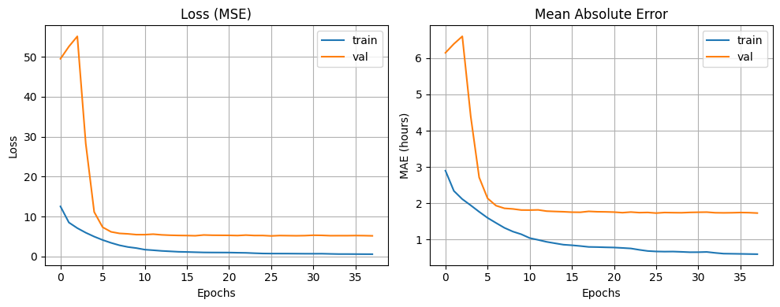
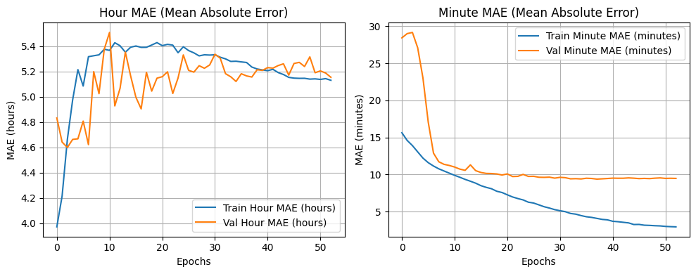
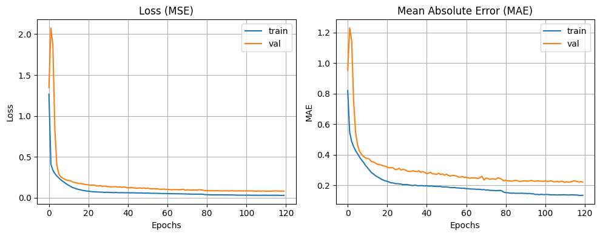

# Reading Analog Clocks with CNNs: How Output Representation Decides the Result

Five ways of framing the same task — predict the time from a photo of an analog clock — trained
on the same 18,000-image dataset with the same family of convolutional backbones. Plus a
48-configuration architecture sweep on Fashion-MNIST, with the best models retrained on CIFAR-10.

**Changing only how the target is represented moves the error from 182.93 minutes to 8.52
minutes.** The worst formulation is the one that looks most precise: treating time as 720
one-minute classes reaches 100% training accuracy and 1.39% test accuracy, and its mean circular
error is 182.93 minutes — a random guess on a 12-hour clock scores 180. Encoding the same time as
a point on the unit circle, sin(θ) and cos(θ), drops it to 24.40 minutes with no change in task or
data. A second, tuned version of that model reaches 8.52 minutes. In the Fashion-MNIST sweep, the
ranking of the top three architectures **inverts** when the same models are retrained on CIFAR-10.

**Full write-up:** [`report.pdf`](report.pdf)

## Background

Clock time is periodic: 11:59 and 12:00 are one minute apart, but any representation that treats
time as a number on a line puts them 719 minutes apart. Every result below follows from how each
model handles that wrap-around.

Five formulations of the target:

| Approach | Output layer | What it assumes |
|---|---|---|
| Classification | Softmax over 12 / 24 / 720 bins | Time is categorical; bins are unordered |
| Regression | One linear unit, fractional hours | Time is a number on a line |
| Multi-head | Two linear units, hours and minutes | Hours and minutes are separable, hours circular |
| sin/cos encoding | Two linear units, sin(θ) and cos(θ) | Time is an angle |
| Optimised sin/cos | Same, deeper net plus augmentation | As above, with more capacity and regularisation |

All are scored with **common-sense error (CSE)**: the mean circular difference in minutes between
predicted and true time, taking the shorter way around the dial. It is the only metric comparable
across all five, and it caps at 360 minutes.

## Results

### Task 2 — tell the time

| Model | Native metric | CSE (min) |
|---|---|---|
| Classification, 720 classes | 1.39% accuracy | 182.93 |
| Regression, fractional hours | 1.94 h MAE | 114.16 |
| Multi-head, hours + minutes | 5.66 h / 9.79 min MAE | 93 |
| Classification, 24 classes | 39.17% accuracy | 82.82 |
| Classification, 12 classes | 47.61% accuracy | 63.87 |
| sin/cos encoding | 0.2067 linear MAE | 24.40 |
| **Optimised sin/cos** | 0.0946 linear MAE | **8.52** |

Sorted worst to best, the table does not track model complexity or output granularity. It tracks
how well the representation matches the geometry of a clock face.


The 720-class model is the clearest failure. Training accuracy reaches 100% by epoch 30 while
validation accuracy stays flat near 1% and validation loss climbs from 6.5 past 8.5 — memorisation
with no generalisation at all. With 720 unordered bins over 18,000 images, each class holds roughly
25 examples, and softmax treats a prediction of 11:59 for a true 12:00 as exactly as wrong as
predicting 6:00. Coarsening to 12 bins throws away resolution and improves CSE by 119 minutes.



Regression on fractional hours halves the error to 114.16 minutes but hits a ceiling: validation
MAE flattens near 1.7 hours after epoch 10 and never recovers. A linear output cannot represent
the wrap: to move from 11.9 to 0.1 it must travel through the entire range.



The multi-head model splits the difference and reveals an asymmetry. Minute MAE falls quickly and
settles near 10 minutes with train and validation tracking closely, but hour MAE climbs above 5
hours and stays there. That 5.66-hour figure is partly a measurement artifact: the hour head is
trained with a circular MSE loss, so it is free to answer 11.8 when the truth is 0.1 — two hours
apart on the dial, 11.7 apart on a number line. The linear MAE punishes exactly what the loss
allows. The CSE of 93 minutes is the number worth reading.



The sin/cos model removes the discontinuity by construction. Both losses drop within a few epochs
and converge smoothly with no divergence, and CSE falls to 24.40 minutes — a 4× improvement over
the best classifier, from a two-unit output layer.


The optimised version adds a fifth convolutional block, L2 on the dense layer, dropout raised to
0.5, augmentation (rotation, translation, zoom), a smaller batch, and a longer schedule. CSE reaches
8.52 minutes.

### Task 1 — architecture search on Fashion-MNIST and CIFAR-10

48 configurations (24 MLP, 24 CNN) varying depth, filters, kernel size, activation, optimiser,
initialiser and regularisation.


The two architecture families separate completely. Every CNN configuration scores above roughly
0.921 validation accuracy; every MLP configuration falls below 0.910. The worst CNN beats the best
MLP. Within each family the curve declines smoothly, so the choice of optimiser, initialiser and
regularisation moves accuracy by about two points, while the choice of architecture family moves it
by more than the entire spread of either family.

Top three by validation accuracy, then retrained from scratch on CIFAR-10:

| Configuration | Fashion-MNIST test | CIFAR-10 test |
|---|---|---|
| CNN, ELU, RMSprop, no reg, 64×128 | 92.7% | 67% |
| CNN, ReLU, Adam, L2, 32×64×128 | 92.0% | **73%** |
| CNN, ReLU, SGD, no reg, 32×64 | **92.9%** | 71% |

The ranking inverts. The configuration that came last of the three on Fashion-MNIST comes first on
CIFAR-10, and the one that led on CIFAR-10 was the weakest of the three on the dataset it was
selected on. The deeper, L2-regularised model gains where the data is harder — CIFAR-10 has colour,
texture and background variation that a shallow unregularised net can overfit but not exploit.
Selecting an architecture on one dataset does not transfer, even between two 10-class benchmarks of
similar size.

## Discussion

**Why the representation dominates.** All five clock models share the same convolutional feature
extractor family and see identical pixels. The only thing that changes is the shape of the target
and the loss that scores it. A softmax over 720 bins discards the ordering of time entirely; a
single linear unit keeps the ordering but breaks the circle; sin/cos keeps both, because a
prediction near the true angle is close in Euclidean distance regardless of where on the dial it
sits. The feature extractor was never the bottleneck.

**Why the augmentation is safe here.** Rotating a clock image looks like it should corrupt the
label, but a rigid rotation turns the dial and the hands together, so the reading is unchanged, and
the dataset already contains clocks photographed at varied angles. The augmentation adds variation
the model will meet at test time rather than noise.

**What the 8.52 minutes does and does not show.** The optimised model changes five things at once,
so the gain from 24.40 cannot be attributed to any one of them.

## Limitations

- **The classification models trained without early stopping while every other model used it,** so
  the comparison across output representations is confounded by training regime, not only by
  representation. The 720-class curves show the effect directly.
- **The optimised sin/cos model changes architecture, regularisation, augmentation, batch size and
  schedule simultaneously.** No ablation isolates which change produced the improvement.
- **Preprocessing is inconsistent across scripts.** `regression.py` filters rows to valid hour and
  minute ranges before training; the other four scripts do not.
- **Single seed, single split.** Every number comes from one run at `random_state=42` with no
  variance estimate, and the CIFAR-10 ranking inversion is drawn from three models on one split.
- **Task 1 reports test accuracy for models selected on validation accuracy**, which is correct, but
  the top three were then retrained on CIFAR-10 and compared on test accuracy directly, with no
  separate CIFAR-10 model selection.
- **Hour MAE for the multi-head model is a linear metric on a circular quantity** and overstates the
  error; only CSE is comparable across models.

## Repository structure

| Path | Purpose |
|---|---|
| `task1_architecture_search/architecture_search.py` | 48-config sweep on Fashion-MNIST, top-3 retrained on CIFAR-10 |
| `task2_tell_the_time/classification.py` | Softmax over 12 / 24 / 720 time bins |
| `task2_tell_the_time/regression.py` | Single linear output, fractional hours |
| `task2_tell_the_time/multi_head.py` | Two heads, circular MSE on hours, MSE on minutes |
| `task2_tell_the_time/sincos_label_transform.py` | Two linear outputs, sin/cos of the clock angle |
| `task2_tell_the_time/sincos_optimised.py` | Deeper backbone, augmentation, L2, final model |
| `report.pdf` | Full write-up, methods and analysis |
| `figures/` | Plots from the report, embedded above |

## Data

Fashion-MNIST and CIFAR-10 download automatically through `tf.keras.datasets`.

The tell-the-time dataset is course-provided and is not redistributed here. The scripts expect two
NumPy files in the working directory:

| File | Shape | Contents |
|---|---|---|
| `images.npy` | (18000, 150, 150) | Grayscale analog clock images, uint8 |
| `labels.npy` | (18000, 2) | Integer `[hour, minute]` per image |

Images vary in viewing angle, rotation and lighting. A 75×75 version was used for early
experiments; all reported numbers are from 150×150. The scripts normalise pixels to [0, 1], add a
channel axis, and split 80/10/10 with `random_state=42`.

## Requirements and running it

```
numpy
pandas
matplotlib
scikit-learn
tensorflow
```

```bash
pip install -r requirements.txt
python task2_tell_the_time/sincos_optimised.py
```

Trained on Google Colab with a T4 GPU. Run each script from a directory containing `images.npy` and
`labels.npy`. `architecture_search.py` trains 48 models plus three CIFAR-10 retrains and writes
checkpoints, per-epoch logs and JSON summaries to `results/`; it needs a GPU and several hours.

## Contributions

- Nallathambi Vethiappan
- Deepak Somesh K J
- Divyanshi Singh
